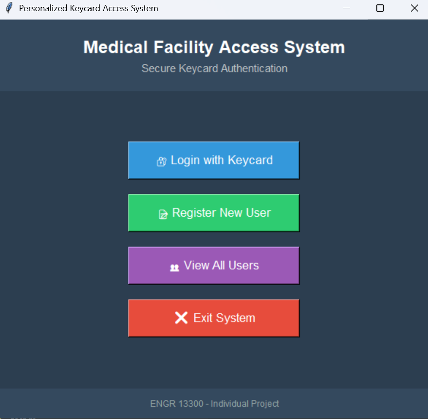
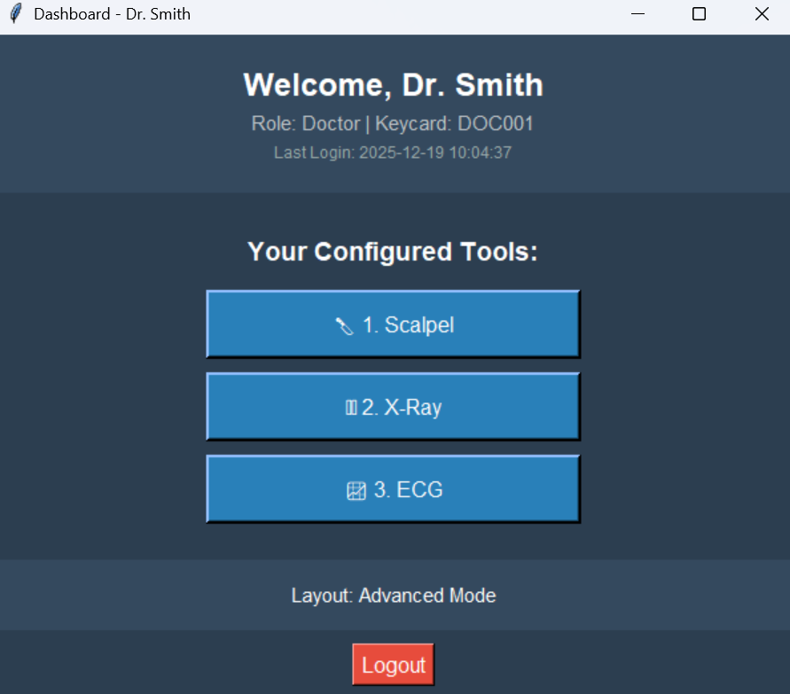
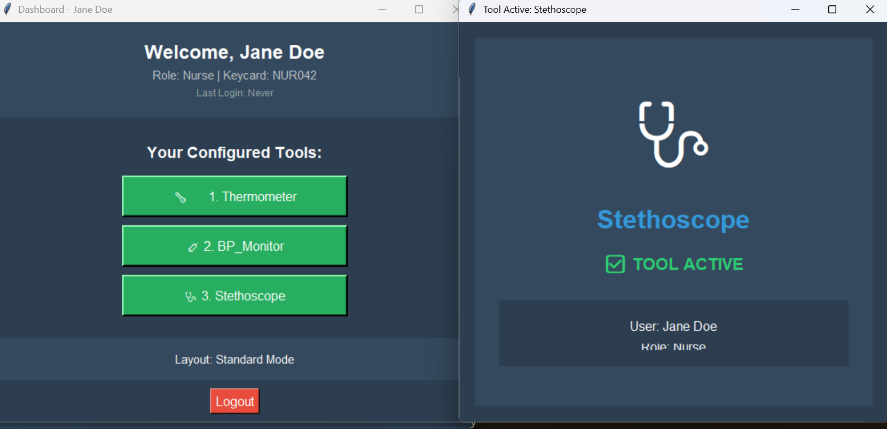
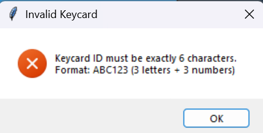
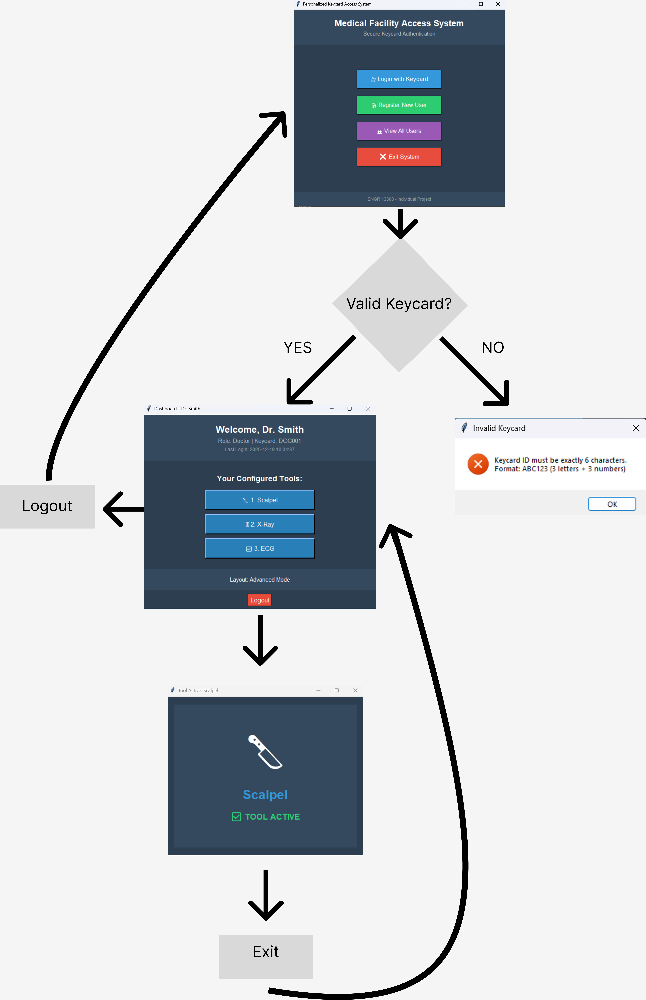

# Personalized Keycard Access Simulator

## Description
A role-based access control system simulating secure authentication for hospital staff. Users log in with unique keycards and access tools relevant to their role. Dashboards are color-coded, and error feedback guides users through incorrect input. Built in Python with Tkinter, using Excel for persistent data storage.

## Features
- Role-based dashboards (Blue = Doctor, Green = Nurse, Red = Admin)
- Error feedback and input validation for security and usability
- Data persistence with Excel for login history and configuration
- Interactive GUI with personalized tool layouts

## Problem
In hospitals, different personnel need access to different tools and systems. One-size-fits-all interfaces are inefficient and confusing, increasing errors and slowing workflow.

## Design
- User-centered role-based dashboards
- Color coding and visual cues to improve clarity
- Error feedback loops for input validation
- Persistent storage to maintain user data and login history

## Implementation
- **Language:** Python 3  
- **Libraries:** Tkinter, pandas, openpyxl  
- **Files:**  
  - `main.py` – GUI interface  
  - `auth_module.py` – Authentication and role logic  
  - `keycard_database.xlsx` – Auto-generated user database

## Screenshots

### Login Screen

### Doctor Dashboard

### Nurse Dashboard

### Admin Dashboard

### Error Feedback Example

## Workflow Diagram

## Outcome
- Improved usability and efficiency for multi-role access  
- Demonstrated user-centered design and iterative testing  
- Provided a foundation for scaling to real-world hospital systems

## Skills Demonstrated
- UX / Product Design: User flows, dashboards, error feedback  
- Python GUI Development (Tkinter)  
- Data Handling & Persistence (Excel integration)  
- Iterative Design, Testing, and Usability Evaluation
